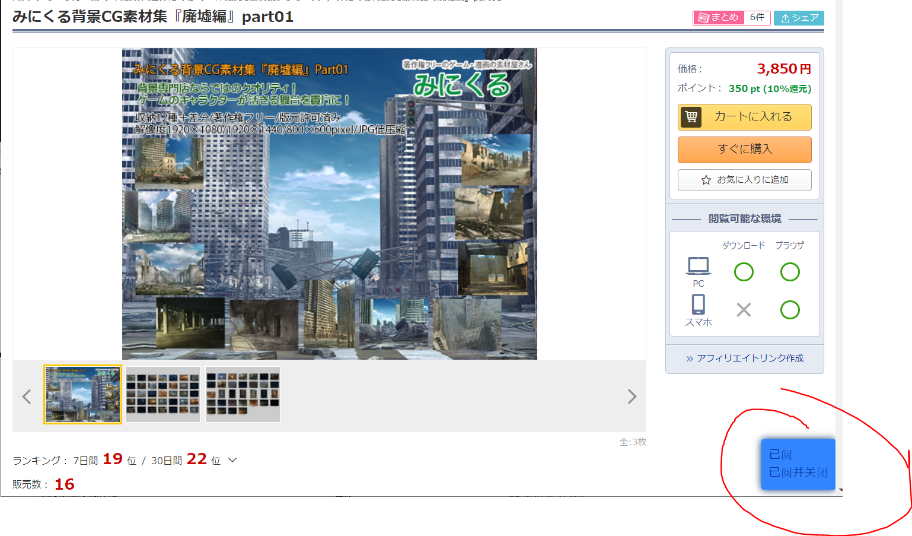
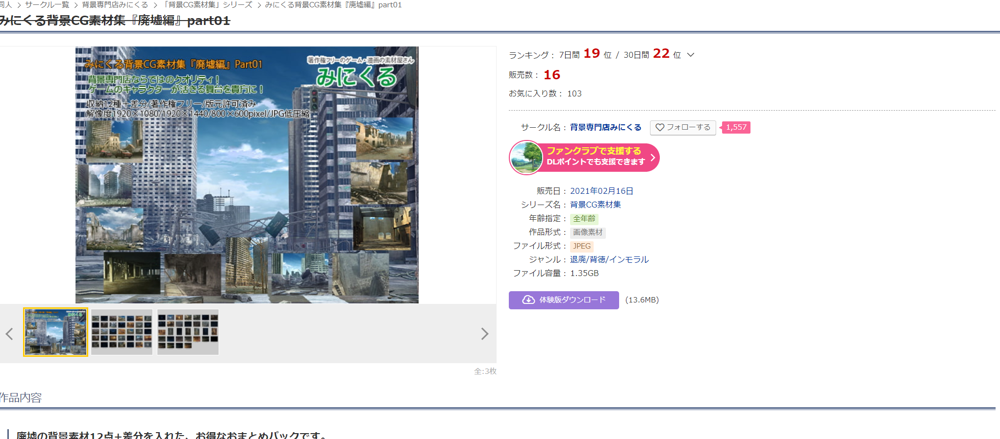
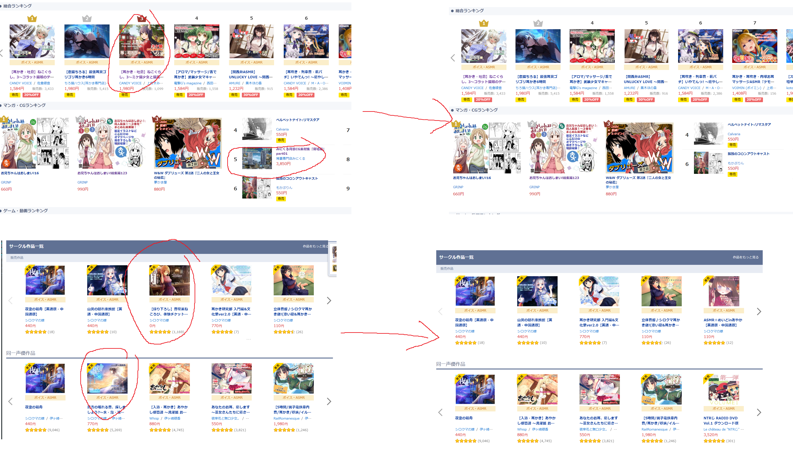
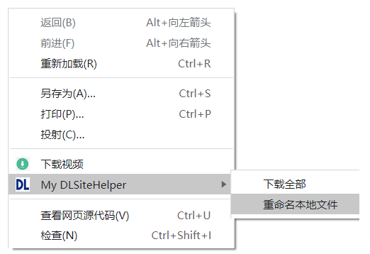
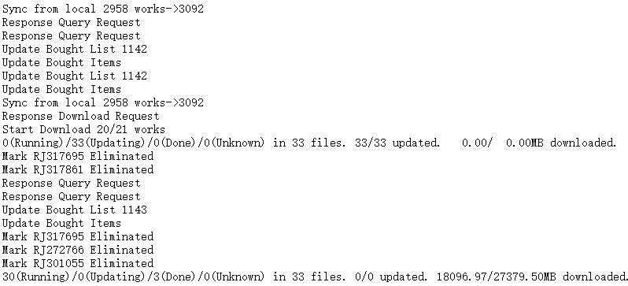
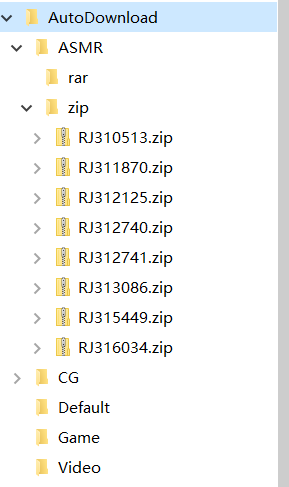
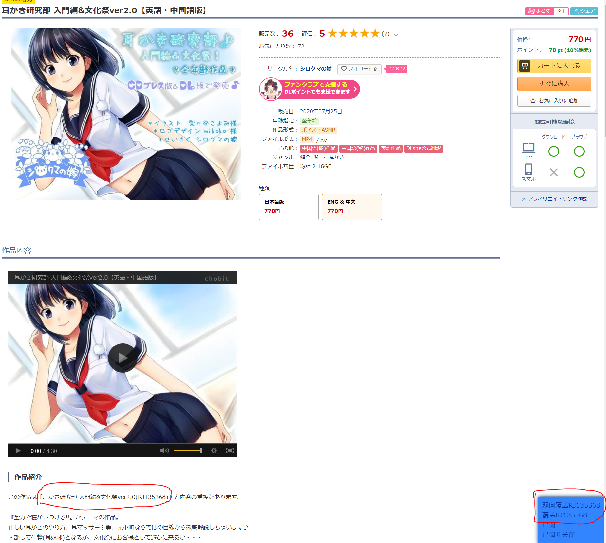

## DLSiteHelper  
DLSite专用Chrome插件，与运行在本地的[DLSiteHelperServer](https://github.com/xyzkljl1/DLSiteHelperServer)配套使用，需要在运行DLSiteHelperServer之后启动  

## Run  
于本地运行DLSiteHelperServer  
以开发者模式在Chrome中"加载已解压的扩展程序"

功能：  
1.通过右下角按钮标记商品为为已读  

已读的商品会在标题上显示划线  

2.已下载/已购买/已读的商品 会从搜索、推荐、推送、排行页面消失  

3.一键下载已购买商品(不解压)  

下载由服务端完成，如服务端指定的目录下存在以某商品RJ号命名的文件夹，则其视作已下载

4.重命名本地文件夹

搜索服务端指定的目录,将以RJ命名的文件夹更改为RJ号+标题

5.如果商品介绍里提到了其它商品，可以标记商品内容覆盖和特记排除(被已读商品覆盖的商品也视作已读，特记排除商品自身视作已读，但其覆盖的商品不被视作已读)  

  
## TO DO  
现在是在load时替换元素的，所以会有闪烁，暂时没想到好的解决办法  
同样由于是在load时替换元素，网页加载时间过长就很没用